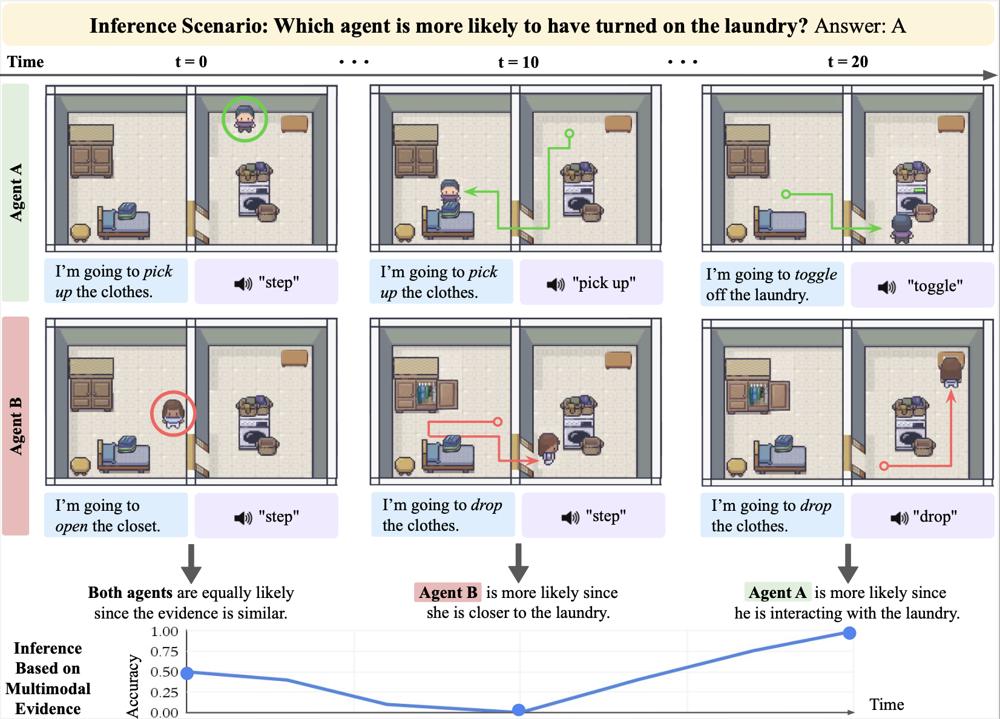

# MARPLE: A Benchmark for Long-Horizon Inference
This repository contains the simulator and experiment code for **MARPLE: A Benchmark for Long-Horizon Inference.**



The Simulator Codebase is developed from https://github.com/StanfordVL/mini_behavior.

## Installation
Before Migration gym 0.21.0 to 0.26.0
```bash
conda create -n marple python==3.10
conda activate marple
# install gym 0.21.0
pip install git+https://github.com/openai/gym.git@9180d12e1b66e7e2a1a622614f787a6ec147ac40

pip install -r requirements.txt
pip install -e .
# if encountered seed issue, delete seed=seed in reset() funcion in minigrid.py
# no need to run pip install inside of marple_mini_behavior
``` 

## Folder Structure
Below is the folder structure of our project:

- `/MARPLE/`
  -  `/gpt/` Code for GPT-4 
    - `azure.py`
    - `/conf/`	
    - `gpt4.py`
    - `helpers.py` 
    - `main.py`
    - `prompts.py` 
    - `/scripts/`
  - `/mcts/` Code for Mental Simulation with Learned Agent Models 
    - `/config/`
    - `/src/`
      - `/marple_mini_behavior/` Simulator Code
      - `/MarpleLongModels/` Model Code
    - `/scripts/`
    - `/utils/`
  - `/figures/`
  - `/plot/`
  - `setup.py`
  - `requirements.txt`
  - `.gitignore`
  - `datasheet.md`
  - `README.md`

 